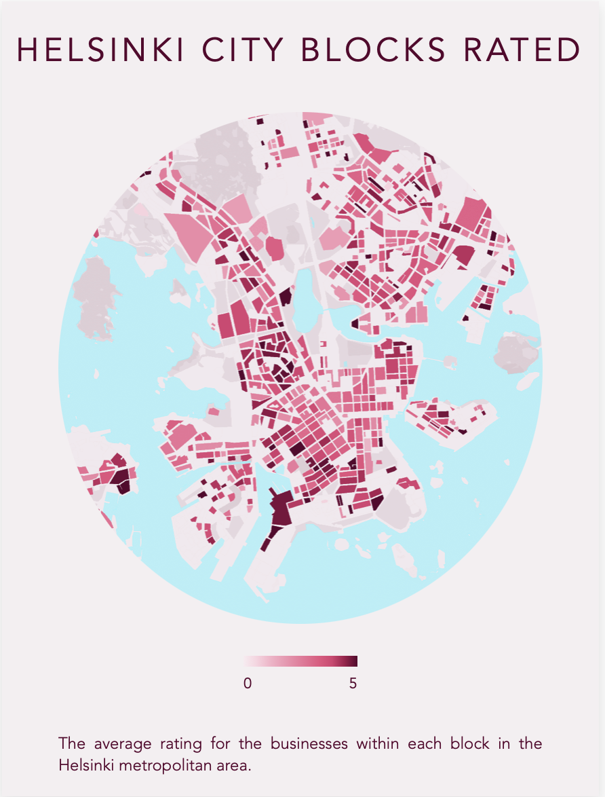
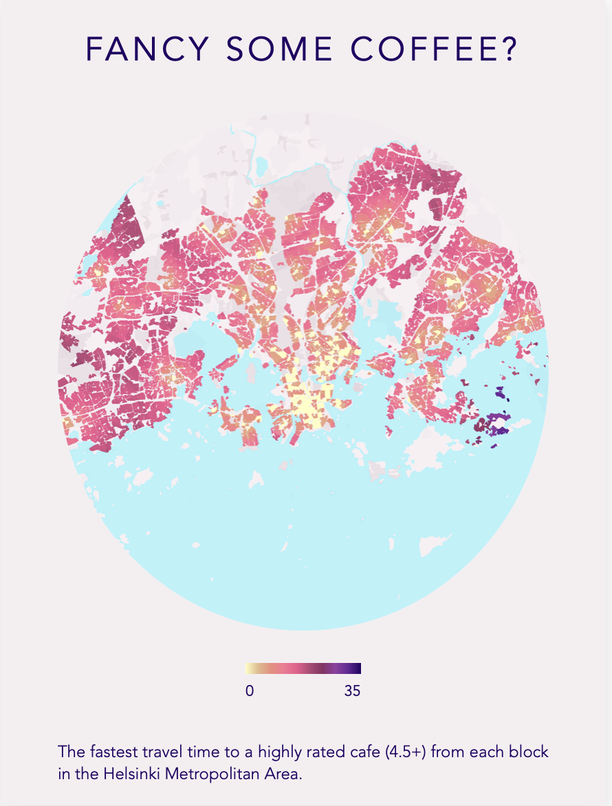
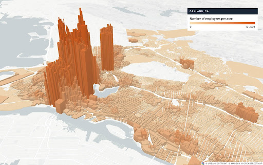
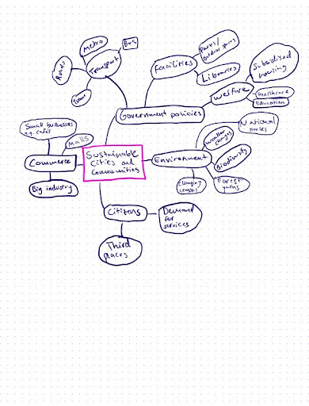
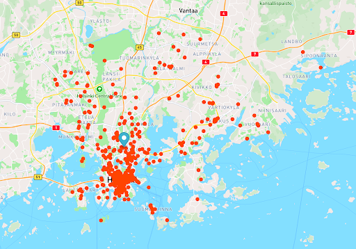
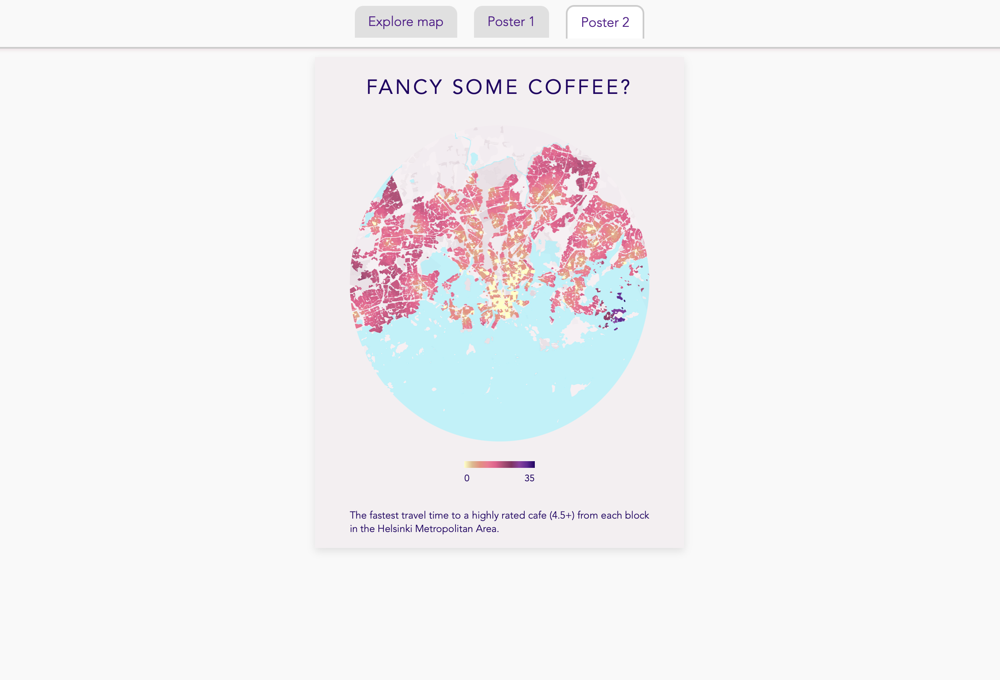

# Third places of Helsinki - an exploration

The project can be viewed at: https://third-places-of-helsinki.onrender.com

In map-based games, design choices guide the players’ understanding of game mechanics and terrain. Meeks (2018) highlights the surprising parallels between game design and data visualisation. Both involve storytelling and visual cues that guide users forward. A map can tell a compelling visual story, with familiar geographical information as the backdrop.
At their core, maps provide evidence on the social organisation of cities. Urban theorist Jacobs (1961) writes about the shortcomings of urban city planning in the US and the spontaneous nature of cities. Her ideas on “mixed use” spaces, i.e. how urban areas need a mix of residential, commercial and industrial spaces to thrive, are still relevant and could be the basis for a narrative on urban development.

“Third places” (Oldenburg and Christensen, 2023) are defined as locations outside of home and work that people use voluntarily, for recreational reasons. One could argue that an imbalance of third places between city districts could point to larger inequalities - in other words, that discriminatory city planning contributes to a lack of high-quality third places.

In my Data Visualisation, I explore how third places define the city of Helsinki. An unfavourable form of urban development is gentrification. Intuitively, gentrification would not be a pertinent issue in Helsinki due to the extensive welfare measures. However, Drain (2024) argues that recent choices in city planning could accelerate inequalities. This makes an interesting paradox with the welfare systems in place. Drain describes Helsinki’s strategies to achieve the “Vibrant City” - but gentrification would provide these transformations only to those able to afford it. While not defining gentrification rigorously with data, it can still serve as the underlying framework to understand the visualisation.

A potential hypothesis is that due to gentrification, less-serviced areas would see a general decrease in quality of the goods and services provided. This could then be reflected in user ratings, highlighting trends where certain areas consistently have lower-rated establishments.

## Approach and themes

Along with a 3D interactive map of the city, a visualisation poster explaining the story was created. A user is free to interact with the map in a game-like fashion, and click on city blocks to view not only the average rating, but the rating of the establishments in that block.

Through the poster, a user will get a fast overview of the theme. Through the minimalistic design, only the most important information is conveyed.

The intended audience for the visualisation are both city planners and citizens. City planners may be interested to observe gaps in public funding and inequalities, and citizens may have a personal interest in their own district as well as interacting with the city environment in a game-like way. From a global perspective, visualising Helsinki is both an opportunity to promote Helsinki as an ideal urban environment, but also highlight some of the issues with inequalities that can be observed worldwide.

The visualisation is related to the sustainable development goals through SDG 11, which relates to sustainable cities and communities. By breaking down the sub-goals into specific metrics they can be applied to Helsinki, promoting positive aspects and highlighting areas for improvement. Hence, the top-level theme of the visualisation would be “Helsinki as a vibrant city”. The sub-level themes have been thought through the general markers of a vibrant city - namely public facilities, commercial facilities, and accessibility. The aim of the visualisation would be to non-verbally communicate to a viewer whether city resources are equally distributed. This can then help further the discussion on how to achieve a more vibrant city for everyone.

_Example of a 3D map visualisation (Hicks, 2019)_

_Mindmap of themes with SDG goal 11: Sustainable cities and communities_

## Usability and data

### Usability of the visualisation

Government officials and policymakers will discover ways that they can improve city planning by exploring differences in facilities and transport systems between city districts. Additionally, civilians and people within the area will learn about the quality of establishments and services provided in their own city district, and the city as a whole. This means that the visualisation is geared towards two very different audiences and expertise levels. Some users will find more value from the poster, and some others will prefer to derive more rich information from the interactive map.

### Interactions

The final visualisation is a web application accessible from the browser, where the user explores a 3D modelled map around and clicks on different city blocks to see key information about them. As the map is 3D, an important aspect of the visualisation would be a point-and-drag mechanism of going around the city.

The poster view is designed in a minimalist way to immediately communicate the aims of the visualisation to the user - only the key information is preserved for maximal impact.

## Data

In order to get the data, the city blocks of Helsinki and Espoo were fetched from Avoindata (Helsingin Kaupunki, 2024, Espoon Kaupunki, 2024b). Using these, the Google Places API was queried to find establishments near each block, along with their ratings. The parameters for the query included a “type”, to determine the type of establishment queried. As the definition of a “third place” is a loose one, I used my knowledge of locations used for free time activities to define a list of location types to query, that were aligned with the APIs predetermined list of “type” variables. The final query included book stores, department stores, parks, museums, beauty salons, malls, spas, bars, gyms, cafes, libraries, restaurants, movie theaters, night clubs, universities, and zoos. The motivation for including universities despite their primary role as a “second place”, stems from the fact that universities also tend to have a lot of spaces open to the public, or for students to spend time in. Thus, for many students in particular, university campuses serve a role as both their second and third place, in contrast to a typical office environment for employees.
For the first stage of the visualisation, the average rating for each block was calculated using the aggregated ratings of businesses within a constrained geodesic distance to the block, effectively gathering ratings within that block. These were added as a layer to the interactive map, and created as a new style on Mapbox Studio for the poster.

The second stage of the visualisation is to calculate the fastest travel time from any block, to a cafe with a rating above 4.5. At first, all of the businesses were queried for locations defined as cafes with a high rating. This resulted in 255 locations across Helsinki and Espoo. In order to calculate the travel times, the Helsinki Region Travel Time Matrix (Fink et al., 2024) was downloaded. This involved finding the nearest grid corresponding to each block and cafe using KDTree search, and matching the grid IDs to the source and destination IDs to find the minimum travel time. The travel time matrix stores information on both average, fast and slow travel times for walking, biking, driving and public transportation. The data was filtered on both the destination id’s of the cafes, and the source id’s of the blocks. By filtering separately on source and destination ID’s, a successful match for all blocks and cafes was found.

The closest cafe location to any block was calculated by firstly calculating the fastest travel mode from each of the types, and then determining the fastest time between cafe destinations. These were similarly incorporated into the geoJSON of the blocks, as an “fastest_time” parameter. Visually, the colour gradient chosen was more of a "heatmap" style, to represent proximity.

The final application is rendered using Mapbox GL JS and a Flask app. It fetches a custom monochrome base map style that I created in Mapbox Studio. The basemap for the interactive map is simple, with the geoJSON layers added dynamically. The poster views are static, and thus the processed geoJSON was integrated through Mapbox Studio, where a custom formula gradient was applied to the blocks based on the average rating and fastest time parameters respectively. The fastest time blockstyle was further processed into an mbtiles file, to allow for custom zoom levels.

_Proof-of-concept visualisation of amenities in Helsinki using Mapbox_

_Final interactive map view_

_Poster view_

## Time

Brehmer et al. (2017) posit that time can be represented in a multitude of dimensions and forms. Thus, time can also be an implicit element of the visualisation.

The average ratings are a representation of the present situation in Helsinki and Espoo, and by refetching the ratings at a later stage, these could be collected to understand the evolution of ratings over time. This projects the potential for a multi-year study of the quality of places in the Helsinki metropolitan area.

The fast accessibility to highly rated cafes has a clear connection to time - indicating how accessible a highly rated location is from any given place in the city. This places the user directly into the context of how fastly connected the city is - highlighting how certain areas might be underserviced and thus below the requirements for high quality transport of a city. However, the current map demonstrates that even from remote areas, the closest highly rated location is usually less than 30 minutes away. For future improvements the same could have been calculated without including driving times, to focus the theme on public transport connections within the city.

The difference to a map application, is the visual presentation and the information shared. The concentration of places being represented in a gradient, the poster design, and the themes, allow this visualisation to reveal how Helsinki and its surrounding areas reach the goals of a vibrant city.

## References

Brehmer, M., Lee, B., Bach, B., Henry Riche, N., and Munzner, T., 2017. Timelines revisited: A design space and considerations for expressive storytelling. IEEE Transactions on Visualization and Computer Graphics, XX(X), pp.1–14. Available at: https://www.microsoft.com/en-us/research/wp-content/uploads/2016/10/Brehmer-TVCG-2017.pdf
Data Visualization Society, 2021. Craig Taylor—Outlier 2021—3d Geo Data Viz: From Insight to Data Art. Available at: https://www.youtube.com/watch?v=wxmqG_jxJiw
Drain, K., 2024. Available at: https://helda.helsinki.fi/items/9470c232-d0d7-4e14-ab88-0f3d8fbfa1c4
Espoon Kaupunki, 2024a. My Espoo on the map resident survey responses. Available at: https://hri.fi/data/en_GB/dataset/mun-espoo-kartalla-kyselyn-vastaukset
Espoon Kaupunki, 2024b. Espoon korttelit -aineisto. Available at: https://www.avoindata.fi/data/fi/dataset/espoon-korttelit
Fink, C., Willberg, E., and Toivonen, T., 2024. Helsinki Region Travel Time Matrix 2018–2023. Version 2023.4. Available at: https://zenodo.org/records/11220980
Helsingin Kaupunki, 2024. Helsingin korttelit -aineisto. Available at: https://www.avoindata.fi/data/fi/dataset/helsingin-korttelit
Hicks, B., 2019. Insights that pop: 3D data mapping. Available at: https://urbanfootprint.com/blog/sustainable-cities/map-insights-that-pop-3d-data-mapping/
Jacobs, J., 1961. The Death and Life of Great American Cities. New York: Random House.
Meeks, E., 2018. What video games have to teach us about data visualization. Available at: https://medium.com/nightingale/what-video-games-have-to-teach-us-about-data-visualization-87c25ff7c62f
Oldenburg, R. and Christensen, K., 2023. Third places: True citizen spaces. Available at: https://courier.unesco.org/en/articles/third-places-true-citizen-spaces
